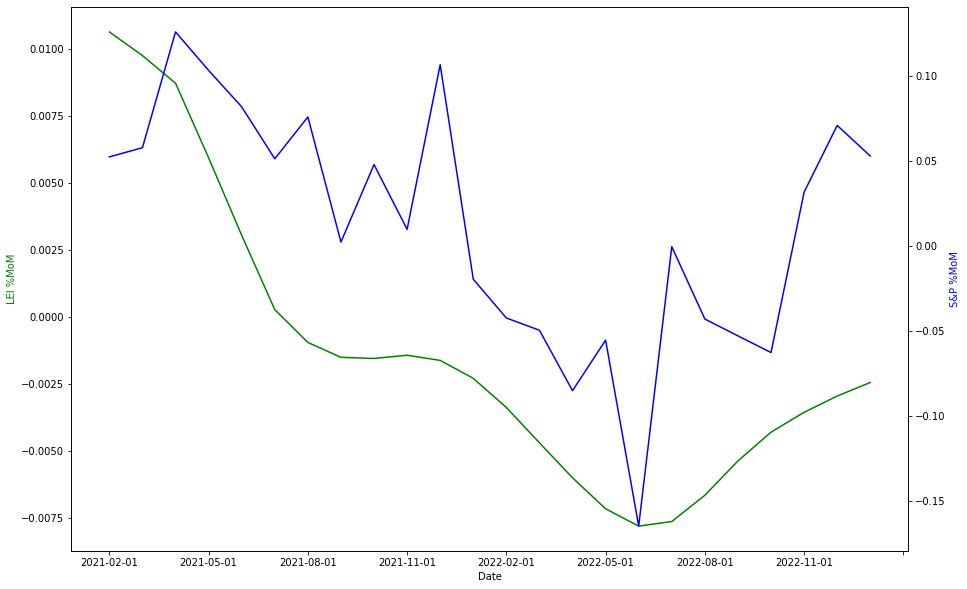
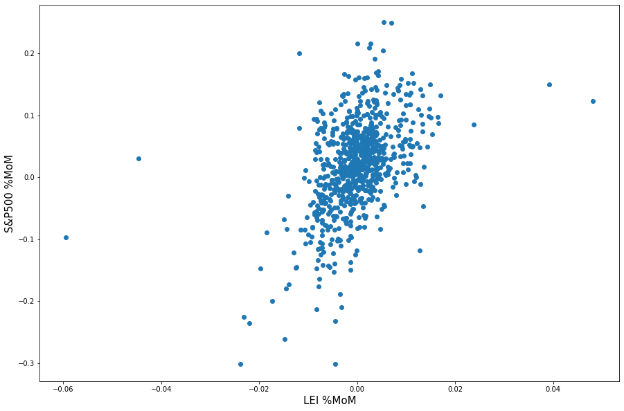
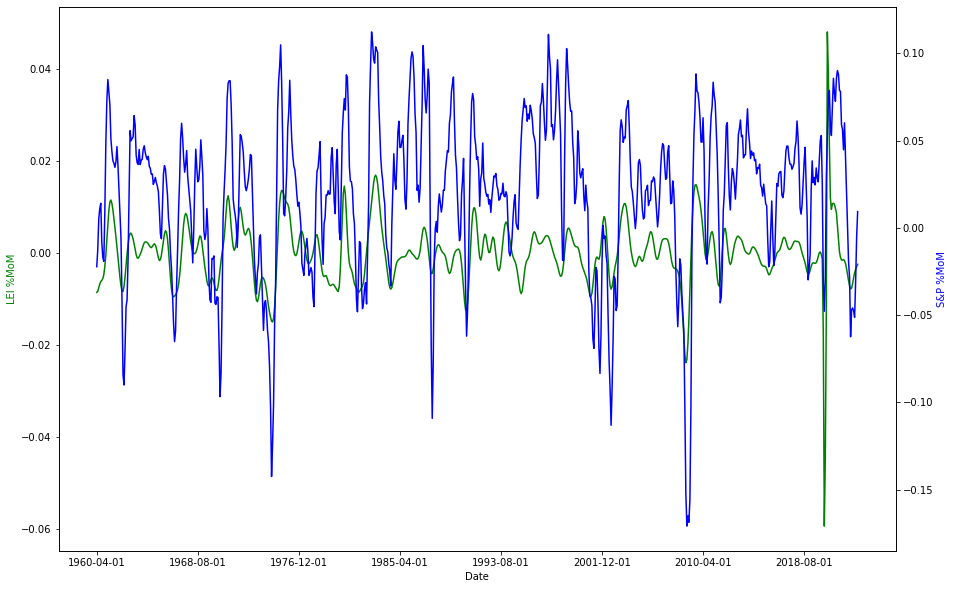

# LEI and S&P 500 Stock Returns Analysis

## Project Overview
This project investigates the predictive power of the U.S. Leading Economic Index (LEI) on the monthly returns of the S&P 500. Through a simple Ordinary Least Squares (OLS) regression and a correlation analysis, this project examines the relationship between changes in the LEI Index and S&P 500 returns, aiming to understand if LEI changes can serve as a predictor for stock market movements.

## Installation and Requirements
This project requires the following Python libraries:
- `pandas` for data handling
- `numpy` for numerical operations
- `pandas_datareader` and `yfinance` for accessing financial data
- `matplotlib` for data visualization

Install dependencies using:
```bash
pip install pandas numpy pandas_datareader yfinance matplotlib
```

## Usage
1. **Data Loading and Preparation**  
   The U.S. LEI data is loaded from the file `"USALOLITONOSTSAM (2).csv"` in the `data` folder. Monthly rate of change calculations are performed to analyze the LEI Index's impact on stock returns. The code snippet for data loading is:
   ```python
   import pandas as pd
   LEI = pd.read_csv("data/USALOLITONOSTSAM (2).csv")
   LEI["USALOLITONOSTSAM"] = pd.to_numeric(LEI["USALOLITONOSTSAM"], downcast="float")
   ```

2. **Performing OLS Regression**  
   An Ordinary Least Squares (OLS) regression is conducted to examine the relationship between LEI changes and S&P 500 returns. The output results are saved in `"OLS_Regression_Results.txt"` within the `docs` folder.

3. **Visualization and Correlation Analysis**  
   Visualizations include time series and scatter plots to help illustrate trends and relationships. Example visualization commands:
   ```python
   import matplotlib.pyplot as plt
   LEI['%MoM'].plot(title='Monthly Changes in LEI')
   ```

## Results Summary
Key findings include insights into the correlation between monthly LEI changes and S&P 500 returns. Visual analysis and OLS regression outputs indicate the potential predictive relationship between these variables.

### Sample Output

*Figure 1. Time series of S&P 500 returns and LEI changes (2021-2023)*


*Figure 2. Scatter plot illustrating the correlation between monthly stock returns and LEI changes*


*Figure 3. Broader time series of S&P 500 returns and LEI changes*

## Files in this Repository
- **data/USALOLITONOSTSAM (2).csv** - CSV file containing U.S. LEI Index data for analysis.
- **docs/LEI_S&P500_OLS_regression.pdf** - PDF document detailing the methodology and findings of the regression analysis.
- **docs/OLS_Regression_Results.txt** - Text file summarizing the results of the OLS regression.
- **figures/** - Folder containing figures illustrating the correlation and regression analysis:
  - `time_series_stock_returns_LEI_changes_2021_2023.png`
  - `scatter_plot_stock_returns_LEI_changes.png`
  - `time_series_stock_returns_LEI_changes.png`

## License
This project is unlicensed.
